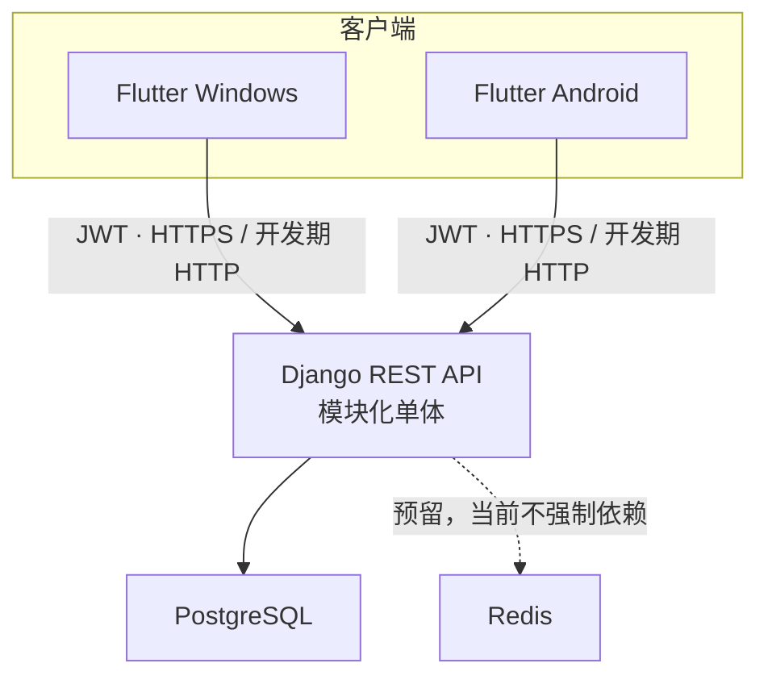

# 系统架构

## 架构选择

- 当前采用 Django 模块化单体，不采用微服务。模块边界清晰，但共享一次部署和同一数据库。
- Flutter 使用 feature-first 分层，页面通过 Riverpod provider/controller 调用 repository，再访问 API client 或平台服务。
- Flutter Token 通过 `TokenStorage` 写入平台安全存储；Dio 负责 Bearer 注入、单航班刷新和 401 失效通知，go_router 只消费认证状态。
- Django 使用 SimpleJWT 验证原生客户端请求，后端权限是目录数据访问的权威边界。
- Windows 与 Android 共享路由、业务状态和绝大部分 UI；只在壳层与平台服务边界处理差异。
- PostgreSQL 是权威持久化存储。Redis 仅预留给未来缓存或短期协调能力，当前后端启动不依赖 Redis。
- iOS 只作为未来可能扩展，不在当前工程、CI 或平台目录中出现。

详细决策见 `docs/decisions/ADR-0001-modular-monolith.md` 与 `ADR-0002-windows-android-first.md`。
