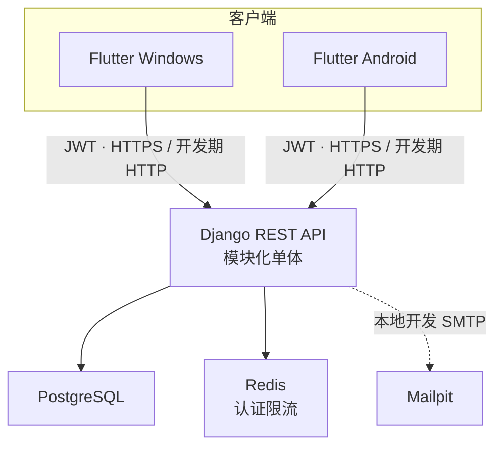

# 系统架构

## 架构选择

- 当前采用 Django 模块化单体，不采用微服务。模块边界清晰，但共享一次部署和同一数据库。
- Flutter 使用 feature-first 分层，页面通过 Riverpod provider/controller 调用 repository，再访问 API client 或平台服务。
- Flutter Token 通过 `TokenStorage` 写入平台安全存储；Dio 负责 Bearer 注入、单航班刷新和 401 失效通知，go_router 只消费认证状态。
- Django 使用 SimpleJWT 签发 Token，`AccountSession` 和 `sid` claim 是受保护 API 的即时会话权威；后端 model permissions 是授权边界。
- Windows 与 Android 共享路由、业务状态和绝大部分 UI；只在壳层与平台服务边界处理差异。
- PostgreSQL 是权威持久化存储。Redis 为登录、邀请接受和密码恢复提供不含原始标识的认证限流缓存。
- `AccountInvitation` 与 `PasswordResetChallenge` 只保存用途隔离的 HMAC-SHA256 摘要；原始一次性码只交给邮件抽象。本地 SMTP 指向 Mailpit，生产邮件配置必须显式提供。
- Flutter 继续复用唯一 ApiClient、TokenStorage、AuthSessionStore、Riverpod 和 go_router；恢复、会话和账号管理按 feature-first 分层。
- iOS 只作为未来可能扩展，不在当前工程、CI 或平台目录中出现。

详细决策见 `docs/decisions/ADR-0001-modular-monolith.md`、`ADR-0002-windows-android-first.md` 与 `ADR-0005-account-lifecycle-session-security.md`。
